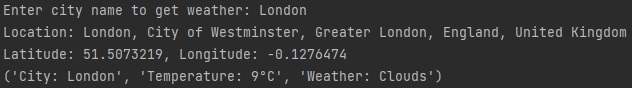
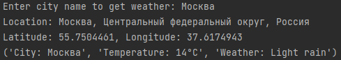

## Table of contents
* [General info](#general-info) ([English](#english), [Русский](#русский))
* [Technologies](#technologies)
* [Setup](#setup) ([Windows](#windows), [Linux](#linux))

## General info
### English
Project "MyWeather" is a small practical task in [Python](https://www.python.org/) using the [geopy](https://geopy.readthedocs.io/) library.
The task is to learn the API, trying the geopy functionality and data type in python language.
The program collects information about the weather in the city using the API from [OpenWeatherMap](https://openweathermap.org/).

Displayed five types of data: City, temperature, weather, latitude and longitude.



Latitude and Longitude getting with geopy by simply having city name.
They also needed as output for the [OpenWeatherMap API](https://openweathermap.org/api) to find information about the city at these coordinates.

### Русский
Проект "MyWeather" представляет собой небольшое практическое задание на языке [Python](https://www.python.org/) с использованием библиотеки [geopy](https://geopy.readthedocs.io/).
Задача в том, чтобы научиться использовать API, опробовать функционал geopy и типизацию данных в языке.
Программа собирает и обрабатывает информацию о погоде в городе с помощью API от [OpenWeatherMap](https://openweathermap.org/).

Отображаются пять типов данных: Город, температура, состояние погоды, ширина и долгота.



Ширина и долгота получаются с помощью geopy, имея просто название города.
Они так же нужны как выходные данные для [OpenWeatherMap API](https://openweathermap.org/api), чтобы найти информацию о городе по этим координатам.

## Technologies
Project created with:
* [python](https://www.python.org/) [3.10](https://www.python.org/downloads/release/python-3100/)
* [geopy](https://geopy.readthedocs.io/) [2.2.0](https://github.com/geopy/geopy/releases/tag/2.2.0)
* [geographiclib](https://geographiclib.sourceforge.io/) [2.0](https://github.com/geographiclib/geographiclib-python/releases/tag/v2.0)
	
## Setup
To run this project, install it locally using git, pip and python:

### Linux
```bash
$ git clone https://github.com/Zeerck/MyWeather
$ pip install -r requirements.txt
$ python3 weather.py
```

### Windows
Install [Python 3.10](https://www.python.org/downloads/) after,
run [Command Line](https://en.wikipedia.org/wiki/Cmd.exe) or [PowerShell](https://en.wikipedia.org/wiki/PowerShell)
in directory with project.

Type:
```commandline
python -m pip install -r requirements.txt
```
That command will install or update dependencies.

Next type:
```commandline
python weather.py
```

## Sources
Using [Python documentation](https://docs.python.org/3/),
[geopy documentation](https://geopy.readthedocs.io/),
[OpenWeatherMap documentation](https://openweathermap.org/api/one-call-3) and etc.